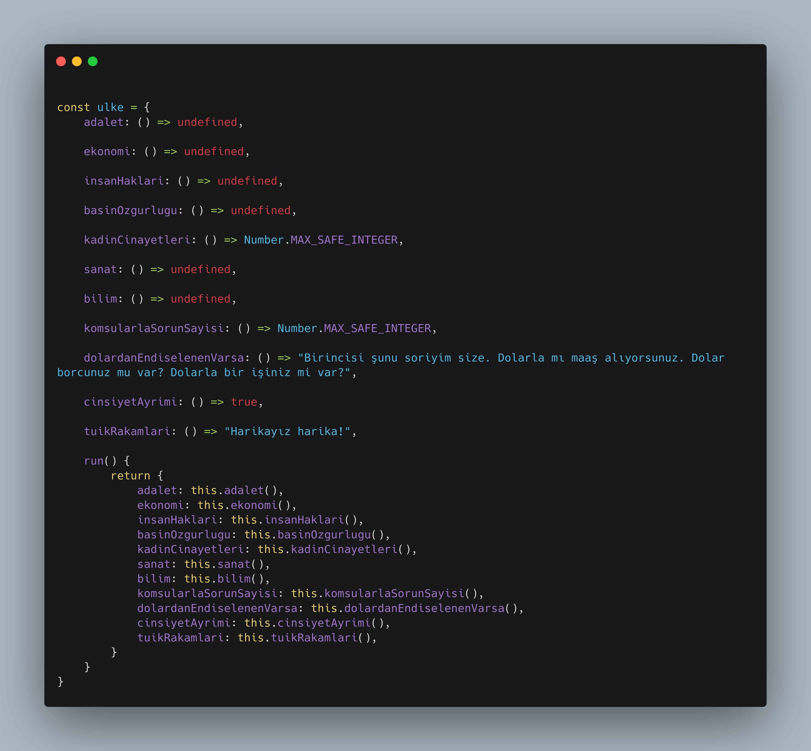

# ulke.js
First release: 29 Ekim 1923

## Usage

```js
ulke.run()
```

## Example Output

```json
{
  adalet: undefined,
  basinOzgurlugu: undefined,
  bilim: undefined,
  cinsiyetAyrimi: true,
  dolardanEndiselenenVarsa: "Birincisi şunu soriyim size. Dolarla mı maaş alıyorsunuz. Dolar borcunuz mu var? Dolarla bir işiniz mi var?",
  ekonomi: undefined,
  insanHaklari: undefined,
  kadinCinayetleri: 9007199254740991,
  komsularlaSorunSayisi: 9007199254740991,
  sanat: undefined,
  tuikRakamlari: "Harikayız harika!"
}
```

## Preview


